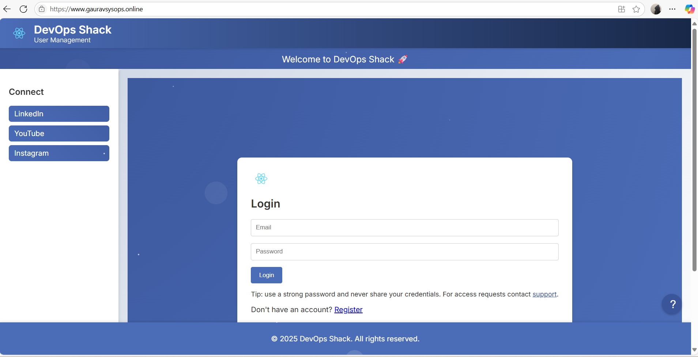

# 3-Tier DevSecOps Project

This 3-Tier DevSecOps project deploys a Node.js API and React client for a user management, leveraging Amazon EKS for container orchestration. Infrastructure is provisioned using Terraform, and access to the Kubernetes cluster is secured via IAM-based RBAC. The Jenkins CI/CD pipeline automates build, test, and deployment stages with integrated code quality checks using SonarQube, Trivy, and GitLeaks for static code analysis and vulnerability scanning. SSL is configured via Let’s Encrypt to ensure secure communication, and DNS is set up using Hostinger with Kubernetes Ingress for production-grade HTTPS access.

### **Technologies & Tools Used**

<a href="https://docs.aws.amazon.com/IAM/latest/UserGuide/introduction.html">
  
</a>
<a href="https://docs.aws.amazon.com/ec2/">
  
</a>
<a href="https://www.kernel.org">
  
</a>
<a href="https://git-scm.com">
  
</a>
<a href="https://github.com">
  
</a>
<a href="https://developer.hashicorp.com/terraform/docs">
  
</a>
<a href="https://docs.aws.amazon.com/vpc/latest/userguide/what-is-amazon-vpc.html">
  
</a>
<a href="https://www.jenkins.io">
  
</a>
<a href="https://github.com/tonistiigi/trivy">
  
</a>
<a href="https://gitleaks.io/">
  
</a>
<a href="https://www.docker.com">
  
</a>
<a href="https://docs.sonarsource.com/sonarqube-server/8.9/">
  
</a>
<a href="https://docs.aws.amazon.com/eks/">
  
</a>
<a href="https://docs.aws.amazon.com/elasticloadbalancing/">
  
</a>
<a href="https://www.hostinger.com/in">
  
</a>

---

##  Lanunch EC2 Server with this configuration :
- **Server Name**: Installer-VM
- **OS**: Ubuntu
- **Instance Type**: t2.medium
- **Key Pair**: `installer_vm`
- **Security Group**: 
  - **Inbound Rules**: Ports 22, 80, 443, 53 (ssh, HTTP, HTTPS, DNS)
  - **Outbound Rules**: All traffic allowed
- **Configuration Storage**: 25 GB

## SSH Access

To access the VM via SSH, use MobaXterm, PuTTY, or command line:

```bash
ssh -i "installer_vm.pem" ubuntu@<public_IP>
````

## Step-by-Step Instructions

### 1. **Update the Server**

Once logged in, update the server packages:

```bash
sudo apt update -y
```

### 2. **Create Security Access Credentials for IAM User**

Create an IAM user and generate the access keys:

* **Access Key ID**: `XXXXXXXXXXXXXX`
* **Secret Access Key**: `XXXXXXXXXXXXXXXXXXXX`

### 3. **Install AWS CLI**

Follow the steps to install the AWS CLI on Ubuntu:

1. **Download AWS CLI**:

```bash
curl "https://awscli.amazonaws.com/awscli-exe-linux-x86_64.zip" -o "awscliv2.zip"
```

2. **Install unzip and extract**:

```bash
sudo apt install unzip
unzip awscliv2.zip
sudo ./aws/install
```

3. **Verify the installation**:

```bash
aws --version
```

4. **Configure AWS CLI**:

```bash
aws configure
```

Provide your **Access Key ID**, **Secret Access Key**, and **Default Region** (e.g., `us-east-1`).

### 4. **Clone the Repository**

Clone the Terraform repository to the server:

```bash
git clone https://github.com/jaiswaladi246/Mega-Project-Terraform.git
```

### 5. **Install Terraform**

Follow the steps to install Terraform on Ubuntu:

1. **Add HashiCorp GPG key**:

```bash
wget -O- https://apt.releases.hashicorp.com/gpg | \
  gpg --dearmor | sudo tee /usr/share/keyrings/hashicorp-archive-keyring.gpg > /dev/null
```

2. **Add the HashiCorp repository**:

```bash
# 1. Download and add HashiCorp GPG key
wget -O- https://apt.releases.hashicorp.com/gpg | \
  gpg --dearmor | sudo tee /usr/share/keyrings/hashicorp-archive-keyring.gpg > /dev/null

# 2. Add the HashiCorp repository
echo "deb [arch=$(dpkg --print-architecture) signed-by=/usr/share/keyrings/hashicorp-archive-keyring.gpg] \
https://apt.releases.hashicorp.com $(lsb_release -cs) main" | \
sudo tee /etc/apt/sources.list.d/hashicorp.list > /dev/null
```

3. **Install Terraform**:

```bash
sudo apt update && sudo apt install -y terraform
```

4. **Verify the installation**:

```bash
terraform --version
```

### 6. **Deploy Infrastructure using Terraform**

1. **Initialize Terraform**:

```bash
terraform init
```

2. **Validate the configuration**:

```bash
terraform validate
```

3. **Format the code**:

```bash
terraform fmt
```

4. **Plan the deployment**:

```bash
terraform plan
```

5. **Apply the configuration**:

```bash
terraform apply --auto-approve
```

### 7. **Configure kubectl**

1. **Update Kubeconfig** for AWS EKS:

```bash
aws eks --region us-east-1 update-kubeconfig --name myproject-cluster
```

2. **Install kubectl**:

```bash
curl -LO "https://dl.k8s.io/release/$(curl -sL https://dl.k8s.io/release/stable.txt)/bin/linux/amd64/kubectl"
curl -LO "https://dl.k8s.io/release/$(curl -sL https://dl.k8s.io/release/stable.txt)/bin/linux/amd64/kubectl.sha256"

sudo install -o root -g root -m 0755 kubectl /usr/local/bin/kubectl
kubectl version --client
```

### 8. **Install eksctl**

1. **Download eksctl**:

```bash
curl -sLO "https://github.com/weaveworks/eksctl/releases/latest/download/eksctl_$(uname -s)_amd64.tar.gz"
tar -xzf eksctl_$(uname -s)_amd64.tar.gz
sudo mv eksctl /usr/local/bin
eksctl version
```

### 9. **Associate IAM OIDC Provider with EKS**

Run the following to associate the IAM OIDC provider with the EKS cluster:

```bash
eksctl utils associate-iam-oidc-provider \
  --region us-east-1 \
  --cluster myproject-cluster \
  --approve
```

### 10. **Create IAM Service Account for EBS CSI Driver**

Create an IAM service account for the EBS CSI driver:

```bash
eksctl create iamserviceaccount \
  --region us-east-1 \
  --name ebs-csi-controller-sa \
  --namespace kube-system \
  --cluster myproject-cluster \
  --attach-policy-arn arn:aws:iam::aws:policy/service-role/AmazonEBSCSIDriverPolicy \
  --approve \
  --override-existing-serviceaccounts
```

### 11. **Install EBS CSI Driver**

```bash
kubectl apply -k "github.com/kubernetes-sigs/aws-ebs-csi-driver/deploy/kubernetes/overlays/stable/ecr/?ref=release-1.11"
```

### 12. **Install NGINX Ingress Controller**

```bash
kubectl apply -f https://raw.githubusercontent.com/kubernetes/ingress-nginx/main/deploy/static/provider/cloud/deploy.yaml
```

### 13. **Install cert-manager**

```bash
kubectl apply -f https://github.com/cert-manager/cert-manager/releases/download/v1.12.0/cert-manager.yaml
```

### 14. **Check Cluster Nodes**

Verify that the EKS nodes are up and running:

```bash
kubectl get nodes
```

---


### Create VM for Jenkins-server & sonarQube-server

1. **Launch Virtual Machines:**

   * Jenkins & SonarQube servers are being provisioned on Ubuntu instances (`t2.medium`).
   * Ensure the inbound rules for ports `80(http), 443(https), 8080(jenkins), 9000(sonarqube), 10250 (kubelet API), 30000-32767( NodePort services), 53 (DNS), 22(ssh)` are allowed on the security group. This allows Jenkins UI (`8080`) and SonarQube UI (`9000`) to be accessible from the browser.

2. **SSH Access:**

   * You’ll SSH into the servers using a key pair, which is assumed to be pre-generated and downloaded (`installer_vm`).

3. **Updating the server:**

   * Basic updates to ensure the packages are up-to-date.

```bash
   sudo apt update -y
```

---

### Jenkins and SonarQube Setup

#### **Jenkins Installation**

1. **Java Installation:**

   * Installing `OpenJDK-21` on Ubuntu to support Jenkins.

```bash
   sudo apt install fontconfig openjdk-21-jre -y
   java -version
```

2. **Jenkins Installation:**

   * Adding Jenkins' official repository and installing Jenkins.

```bash
   sudo wget -O /etc/apt/keyrings/jenkins-keyring.asc \
   https://pkg.jenkins.io/debian-stable/jenkins.io-2023.key
   echo "deb [signed-by=/etc/apt/keyrings/jenkins-keyring.asc]" \
   https://pkg.jenkins.io/debian-stable binary/ | sudo tee \
   /etc/apt/sources.list.d/jenkins.list > /dev/null
   sudo apt-get update
   sudo apt-get install jenkins -y 
```

3. **Start Jenkins and Enable it:**

   * Enable Jenkins to start at boot.

```bash
   sudo systemctl enable Jenkins --now
   sudo systemctl status jenkins
```

4. **Get Jenkins Admin Password:**

   * Retrieve the Jenkins initial admin password to access the Jenkins UI.

```bash
   sudo cat /var/lib/jenkins/secrets/initialAdminPassword
```

---

#### **SonarQube Setup**

1. **Install Docker on SonarQube Server also on Jenkins-server:**

    Docker installation guide on Ubuntu.

```bash
   sudo apt-get update
   sudo apt-get install ca-certificates curl
   sudo install -m 0755 -d /etc/apt/keyrings
   sudo curl -fsSL https://download.docker.com/linux/ubuntu/gpg -o /etc/apt/keyrings/docker.asc
   sudo chmod a+r /etc/apt/keyrings/docker.asc

   ### Add the repository to Apt sources:
   echo \
"deb [arch=$(dpkg --print-architecture) signed-by=/etc/apt/keyrings/docker.asc] https://download.docker.com/linux/ubuntu \
   $(. /etc/os-release && echo "${UBUNTU_CODENAME:-$VERSION_CODENAME}") stable" | \
   sudo tee /etc/apt/sources.list.d/docker.list > /dev/null
   sudo apt-get update
   # To install the latest version, run:
   sudo apt-get install docker-ce docker-ce-cli containerd.io docker-buildx-plugin docker-compose-plugin

```
###  **Start Jenkins and Enable it:**

     Enable Jenkins to start at boot.

   ```bash
   sudo systemctl enable Jenkins --now
   sudo systemctl status jenkins
   ```
     Add ubuntu user has permission to docker

  ``` bash 
sudo usermod -aG docker ubuntu
# change applied
newgrp docker
   ```


2. **Run SonarQube Container:**

   * Run SonarQube as a Docker container (`sonarqube:lts-community`).

```bash
   docker run -d --name sonar -p 9000:9000 sonarqube:lts-community
```


3. **SonarQube Web UI Access:**

   * Access SonarQube through `http://<server-ip>:9000`.
   * Default credentials: `admin/admin`.


### **4 . Connect SonarQube with Jenkins**

1. **Generate Token in SonarQube**:

   * Navigate to: `Administration > Security > Users`.
   * Select the **Administrator** user and click on **Generate Token**.
   * Enter the name **"Jenkins"**, and click **Generate**.
   * Copy the generated token (e.g., `squ_62d77375eead75082e78e2276523b040219b38c0`).

---

### **5. Add SonarQube Token to Jenkins Credentials**

1. Go to: `Manage Jenkins > Credentials > System > Global Credentials > Add Credentials`.
2. Choose the following settings:

   * **Kind**: Secret text
   * **Scope**: Global (Jenkins, nodes, all child items, etc.)
   * **Secret**: Paste the SonarQube token you copied.
   * **ID**: `sonar-token`
   * **Description**: `sonar-token`
3. Click **Create** to save the credentials.

---

### **6. Configure Tools in Jenkins**

1. **SonarQube Scanner**:

   * Navigate to: `Manage Jenkins > Global Tool Configuration`.
   * Find **SonarQube Scanner** and click **Add SonarQube Scanner**.
   * **Name**: `sonar-scanner`
   * **Install Automatically**: Checked
   * **Version**: `SonarQube Scanner 7.1.0.4889`

2. **Node.js**:

   * In the same section, find **NodeJS** and click **Add NodeJS**.
   * **Name**: `nodejs23`
   * **Version**: `NodeJS.23.1.0`
   * Click **Apply**.

---

### **7. Configure SonarQube Server in Jenkins**

1. Go to: `Manage Jenkins > Configure System > SonarQube Servers`.
2. Add a new **SonarQube installation** with the following settings:

   * **Name**: `sonar`
   * **Server URL**: `http://<sonar-IP>:9000`
   * **Server Authentication Token**: Select `sonar-token` (the credential you added earlier).
3. Click **Save** to apply the changes.

---

### **8. Add Webhook on SonarQube Server**

1. In SonarQube, go to: `Administration > Configuration > Webhooks`.
2. Click **Create** and enter the following details:

   * **Name**: `SonarQube-Webhook`
   * **URL**: `http://<jenkins-server-IP>:8080/sonarqube-webhook/`
3. Click **Create** to save the webhook configuration.

---


### Jenkins Pipeline Configuration

#### **Pipeline Configuration in Jenkins**

* **Install necessary plugins** like:

  * **Pipeline**: (Pipeline: Stage View )For Jenkins pipeline support.
  * **SonarQube Scanner**: (SonarQube Scanner 2.18) For SonarQube integration.
  * **Docker**: (Docker Pipeline , Docker, Docker CommonsVersion) For Docker operations.
  * **NodeJS**: (NodeJS 1.6.5) For Node.js support.
  * **Kubernetes**: ( Kubernetes, Kubernetes Credentials,  Kubernetes CLI, Kubernetes Client API) For Kubernetes integration.
  * **generic-webhook-trigger**: Payload for github to trigger jenkins pipeline on commit.


### ** Create Docker Token from Docker Hub**

1. Go to [Docker Hub](https://hub.docker.com/).

2. Navigate to your **Profile settings**: `https://app.docker.com/accounts/gchauhan1517/settings/personal-access-tokens`.

3. Under **Personal Access Token**, click **Generate New Token**.

4. Fill in the details:

   * **Token Description**: `three-tier-project`
   * **Expiration Date**: `30 days`
   * **Access Permissions**: `Read & Write`

5. Click **Generate** to create the token.

6. **Copy** the generated token.

---

### ** Use the Docker Access Token with Docker CLI**

1. **Docker CLI Login**:

   * Open your terminal and run:

     ```bash
     docker login
     ```
2. When prompted for **username**, enter your Docker Hub username (`<dockerhub-username>`).
3. At the **password prompt**, enter the **personal access token** you just created (`<token>`).

---

### **3. Add Docker Credentials to Jenkins**

1. In Jenkins, go to: `Dashboard > Manage Jenkins > Credentials > System > Global Credentials (Unrestricted) > Add Credentials`.
2. Choose the following settings:

   * **Kind**: `Username with password`
   * **Scope**: `Global (Jenkins, nodes, all child items, etc.)`
   * **Username**: `gchauhan1517` (your Docker Hub username)
   * **Password**: `<docker-hub-token>` (the personal access token you created)
   * **ID**: `docker-cred`
   * **Description**: `docker-cred`
3. Click **Create** to save the Docker credentials.

---

#### **Jenkinsfile for CI/CD:**

This is the heart of the CI/CD pipeline.

1. **Stages** in the pipeline:

   * **Git Checkout**: Pull code from GitHub.
   * **Frontend & Backend Compilation**: Runs `node --check` to lint the JS code.
   * **GitLeaks Scan**: Detects any secrets in the source code.
   * **SonarQube Analysis**: Runs SonarQube scan.
   * **Quality Gate Check**: Waits for SonarQube quality gate to pass.
   * **Trivy File System Scan**: Scans the code base for vulnerabilities.
   * **Docker Build & Push**: Builds Docker images for the frontend and backend, and pushes them to Docker Hub.
   * **Manual Approval for Production**: A manual approval before production deployment.
   * **Deployment to Production (Kubernetes)**: Deploys to Kubernetes using the `kubectl` commands.
   * **Verify Deployment**: Ensures deployment was successful by checking the pod and ingress status in the Kubernetes cluster.

---

### Docker & Kubernetes Integration

1. **Docker Hub Authentication:**

   * Create Docker Hub access tokens and add them to Jenkins credentials.

2. **Kubernetes RBAC (Role-Based Access Control):**

   * **Namespace Creation**: Define `prod` namespace.
   
   ### REF: https://kubernetes.io/docs/concepts/overview/working-with-objects/namespaces/
   ### REF: https://kubernetes.io/docs/tasks/administer-cluster/namespaces/#creating-a-new-namespace

   namespace.yaml
```bash
   apiVersion: v1
   kind: Namespace
   metadata:
   name: prod
```
```bash
   kubectl create -f namespace.yaml
```

   * **Service Account**: Create a service account for Jenkins to interact with Kubernetes.
   ### REF: https://kubernetes.io/docs/concepts/security/service-accounts/

   ServiceAccount.yaml
```bash
   apiVersion: v1
   kind: ServiceAccount
   metadata:
   name: jenkins
   namespace: prod
```

```bash
   kubectl create -f ServiceAccount.yaml
```

   * **Roles and ClusterRoles**: Create specific roles with the necessary permissions.
   ### REF: https://kubernetes.io/docs/reference/access-authn-authz/rbac/

   role.yaml
```bash
   apiVersion: rbac.authorization.k8s.io/v1
   kind: Role
   metadata:
   name: jenkins-role
   namespace: prod
   rules:
   # Permissions for core API resources
   - apiGroups: [""]
      resources:
         - secrets
         - configmaps
         - persistentvolumeclaims
         - services
         - pods
      verbs: ["get", "list", "watch", "create", "update", "delete","patch"]

   # Permissions for apps API group
   - apiGroups: ["apps"]
      resources:
         - deployments
         - replicasets
         - statefulsets
      verbs: ["get", "list", "watch", "create", "update", "delete","patch"]

   # Permissions for networking API group
   - apiGroups: ["networking.k8s.io"]
      resources:
         - ingresses
      verbs: ["get", "list", "watch", "create", "update", "delete","patch"]

   # Permissions for autoscaling API group
   - apiGroups: ["autoscaling"]
      resources:
         - horizontalpodautoscalers
      verbs: ["get", "list", "watch", "create", "update", "delete","patch"]
```
```bash
   kubectl create -f role.yaml -n prod
```

### REF: https://kubernetes.io/docs/reference/access-authn-authz/rbac/

   roleBinding.yaml
```bash
   apiVersion: rbac.authorization.k8s.io/v1
   kind: RoleBinding
   metadata:
   name: jenkins-rolebinding
   namespace: prod
   roleRef:
   apiGroup: rbac.authorization.k8s.io
   kind: Role
   name: jenkins-role
   subjects:
   - kind: ServiceAccount
      name: jenkins
      namespace: prod
```

```bash
   kubectl create -f roleBinding.yaml
```

   ### REF: https://kubernetes.io/docs/reference/access-authn-authz/rbac/

clusterRole.yaml
```bash
   apiVersion: rbac.authorization.k8s.io/v1
   kind: ClusterRole
   metadata:
   name: jenkins-cluster-role
   rules:
   # Permissions for persistentvolumes
   - apiGroups: [""]
      resources:
         - persistentvolumes
      verbs: ["get", "list", "watch", "create", "update", "delete"]
   # Permissions for storageclasses
   - apiGroups: ["storage.k8s.io"]
      resources:
         - storageclasses
      verbs: ["get", "list", "watch", "create", "update", "delete"]
   # Permissions for ClusterIssuer
   - apiGroups: ["cert-manager.io"]
      resources:
         - clusterissuers
      verbs: ["get", "list", "watch", "create", "update", "delete"]
```
```bash
   kubectl create -f clusterRole.yaml
```


### REF: https://kubernetes.io/docs/reference/access-authn-authz/rbac/

   ClusterRoleBinding.yaml

```bash
   apiVersion: rbac.authorization.k8s.io/v1
   kind: ClusterRoleBinding
   metadata:
   name: jenkins-cluster-rolebinding
   roleRef:
   apiGroup: rbac.authorization.k8s.io
   kind: ClusterRole
   name: jenkins-cluster-role
   subjects:
   - kind: ServiceAccount
      name: jenkins
      namespace: prod
```
```bash
   kubectl create -f ClusterRoleBinding.yaml
```


   * **Service Account Token**: Generate token from service account and save it in Jenkins for authentication.
```bash
   kubectl auth can-i create secrets --as=system:serviceaccount:webapps:jenkins -n prod
   kubectl auth can-i create storageclasses --as=system:serviceaccount:webapps:jenkins
   kubectl auth can-i create persistentvolumes --as=system:serviceaccount:webapps:jenkins
```


### **1. Get Token from Kubernetes Secret**

1. Run the following command to retrieve the token from the Kubernetes secret:

```bash
   kubectl describe secret jenkins-secret -n prod
```

2. Find the token in the output under the section `token:` and **copy** it.

---

### **2. Add Kubernetes Secret Token to Jenkins**

1. Go to your **Jenkins Dashboard**.
2. Navigate to: `Manage Jenkins > Credentials > System > Global credentials (unrestricted) > Add Credentials`.
3. Select the following options:

   * **Kind**: `Secret text`
   * **Scope**: `Global (Jenkins, nodes, all child items, etc.)`
   * **Secret**: Paste the Kubernetes secret token you copied earlier (`<paste-the-secret-token-get-from-k8s-rback-secret>`).
   * **ID**: `k8s-prod-token`
   * **Description**: `k8s-prod-token`
4. Click **Create** to save the credentials.

---

3. **Deployment to Kubernetes:**

   * Use `kubectl` commands to apply Kubernetes YAML files for MySQL, backend, frontend, CI, and ingress resources.

---

### **1. Add Webhook in GitHub Repository**

1. Go to your **GitHub repository**.
2. Navigate to: `Settings > Webhooks > Add Webhook`.
3. Enter the following details:

   * **Payload URL**:

     ```plaintext
     http://44.208.28.58:8080/generic-webhook-trigger/invoke?token=DevSecOps123
     ```
   * **Content Type**: `application/json`
   * **SSL Verification**: `Disable` (Not recommended for production environments. It's advised to enable SSL verification with proper certificate configurations in production).
   * **Which events would you like to trigger this webhook?**: `Just the push event`
4. Click **Add Webhook** to save.

---

Output:


### 1. **Verify Ingress Configuration:**

Your **Ingress YAML** is already well-structured, and it configures SSL correctly using **Let’s Encrypt**. The annotations for SSL redirection and `cert-manager` issuer are well set up. However, there are a few steps to confirm that the Ingress is functioning properly.

### 2. **Steps Verify the Ingress:**


#### 2.2 **Check the Certificate Status:**

Once applied, cert-manager will handle the ACME challenge and request an SSL certificate from **Let’s Encrypt**. You can check the status of the certificate:

```bash
kubectl get certificate -n prod
```

Look for a **"Ready"** status under the **`status`** column. If it’s not ready, you can check the logs for issues.

#### 2.3 **Verify the Ingress Resource:**

Once the certificate is ready, verify the Ingress resource to ensure everything is set up properly:

```bash
kubectl describe ingress user-management-ingress -n prod
```

Check that the `tls` section is populated with the secret name (`gauravsysops-co-tls`), and the **host** field matches your domain (`gauravsysops.online`).

---

### 3. **Point DNS in Hostinger:**

Now, let’s make sure your **Hostinger DNS** points to the **ALB (Application Load Balancer)**, as you’ve mentioned.

#### 3.1 **Find the ALB DNS Name:**

You can retrieve your **ALB** DNS from the **AWS Console** under **EC2** -> **Load Balancers**:

* Find the ALB used by the Ingress (check under the **Ingress Controller** service).
* Copy the **DNS name** of the ALB (e.g., `my-alb-1234567890.us-east-1.elb.amazonaws.com`).

#### 3.2 **Update DNS Records in Hostinger:**

Go to your **Hostinger DNS settings**:

* **A Record**: For the root domain (`gauravsysops.online`), create an **A record** pointing to the **ALB DNS name** (this resolves the domain to the load balancer).

  Example:

  * **Type**: A
  * **Host**: `@` (for root domain)
  * **Value**: `my-alb-1234567890.us-east-1.elb.amazonaws.com` (ALB DNS)
* **CNAME Record**: For the `www` subdomain (`www.gauravsysops.online`), add a **CNAME** record pointing to the root domain or the ALB DNS name.

  Example:

  * **Type**: CNAME
  * **Host**: `www`
  * **Value**: `gauravsysops.online` (or the ALB DNS)

#### 3.3 **Wait for DNS Propagation:**

DNS changes may take some time to propagate (up to 24-48 hours, but often quicker). You can check if DNS is resolving properly by using:

```bash
nslookup gauravsysops.online
```

Make sure it resolves to your ALB DNS.

---

### 4. **Test SSL/HTTPS Configuration:**

Once DNS is properly set up and the certificate is issued:

1. Open your browser and navigate to `https://gauravsysops.online` and `https://www.gauravsysops.online`.

   * Check if the website is accessible via **HTTPS**.
   * You should see the **green padlock** indicating the SSL certificate is active.

2. You can also verify SSL details using [SSL Labs SSL Test](https://www.ssllabs.com/ssltest/).

### 5. **Verify Ingress with kubectl**:

You can verify the **Ingress resource** to ensure it is properly configured:

```bash
kubectl get ingress -n prod
```

This should show your Ingress resources with correct `host` values (`gauravsysops.online` and `www.gauravsysops.online`) and associated **TLS** certificates (`gauravsysops-co-tls`).

---

2. **Certificate Error:**

   * If there’s a certificate error during deployment, delete and reapply certificates in Kubernetes.
```bash 
   kubectl delete certificaterequest -n prod gauravsysops-co-tls-tlvxv
   kubectl delete certificate -n prod gauravsysops-co-tls
   kubectl apply -f ingress.yaml
   kubectl apply -f ci.yaml 
```
Output:


---
